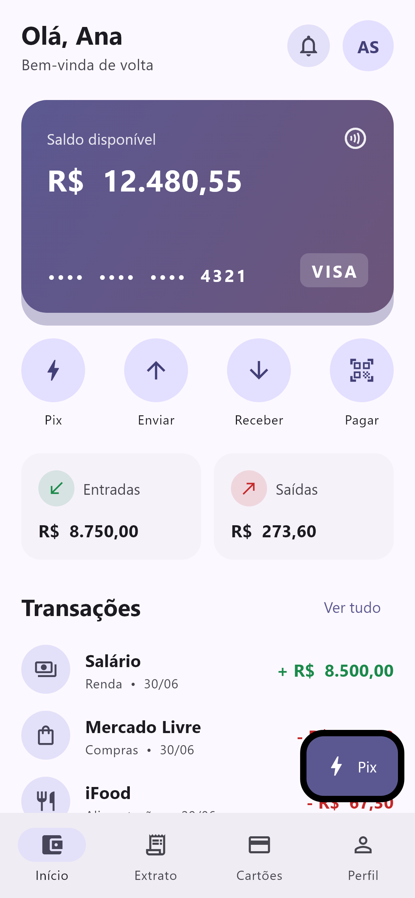
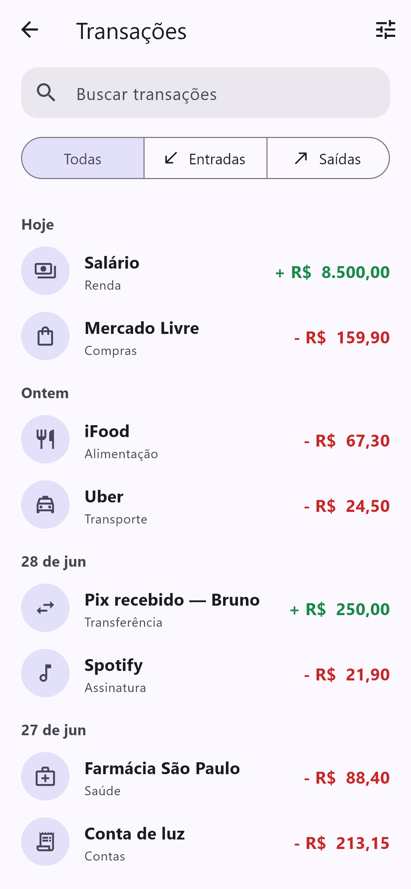
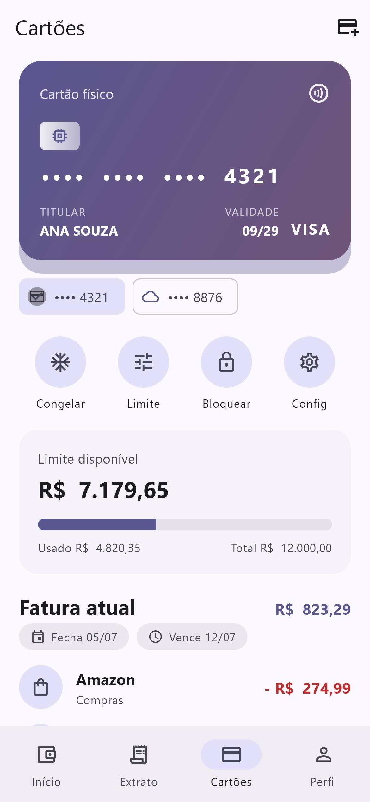
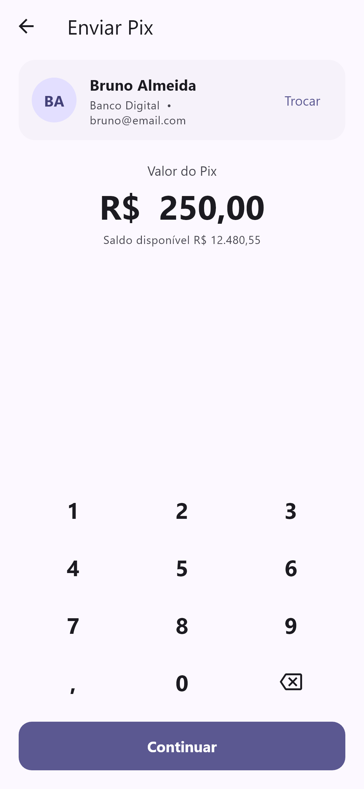
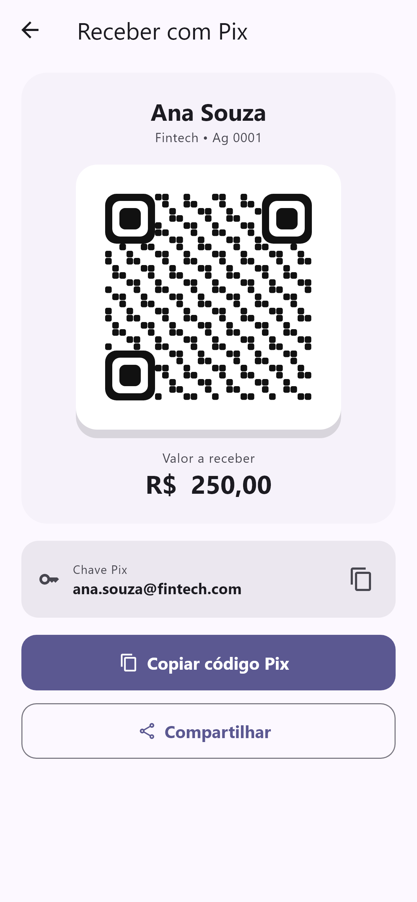
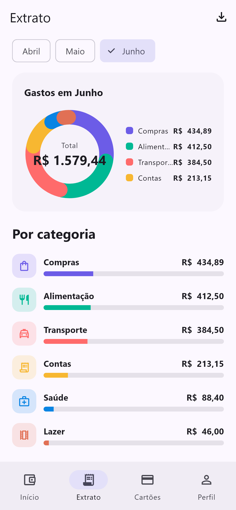

# Flutter Wallet

[Leia em português](./README.pt-BR.md)

[](./LICENSE) 

Flutter Wallet is a free digital wallet and banking UI template built with Flutter 3.44 and Material 3. It has 8 screens with light and dark themes: a wallet home with a balance card and quick actions, a filterable transaction list, card management with limit and invoice, a Pix transfer flow with a custom numeric keypad, a receive screen with a QR code drawn in CustomPaint, a statement with a donut chart of spending by category, an add-card form with a live preview, and a profile with security settings. All data is local mock data, so the app runs with no backend, and the http service stubs mark where a real API would plug in. It is part of the free tier of the [template.dev.br](https://template.dev.br) catalog.

## Screens

8 screens plus a bottom-navigation shell (`lib/ui/features/shell/home_shell.dart`):

- Wallet (`wallet_screen.dart`): balance card, quick actions and recent activity.
- Transactions (`transactions_screen.dart`): full transaction history with filters.
- Cards (`card_detail_screen.dart`): credit card detail with limit and invoice.
- Send Pix (`send_screen.dart`): transfer flow with contact selection and a numeric keypad.
- Receive Pix (`receive_screen.dart`): QR code rendered by a CustomPaint painter (`qr_painter.dart`).
- Statement (`statement_screen.dart`): spending by category in a donut chart (`donut_chart.dart`).
- Add card (`add_card_screen.dart`): card form with a live card preview.
- Profile (`profile_screen.dart`): account data and security options.

### Screenshots

The `screenshots/` folder has 16 captures. A sample:








## Tech stack

- Flutter 3.44, stable channel (pinned through FVM in `.fvmrc`)
- Dart SDK `^3.12.2`
- Material 3 (`useMaterial3: true`, `ColorScheme.fromSeed`)
- go_router `^17.3.0`: declarative routing
- provider `^6.1.5+1`: state management (MVVM view models)
- http `^1.6.0`: API service layer
- intl `^0.20.3`: currency and date formatting
- cupertino_icons `^1.0.8`
- flutter_lints `^6.0.0` (dev)

Exact resolved versions are in `pubspec.lock`. Target platforms included in the repo: Android, iOS, web and Windows.

## Requirements

- Flutter SDK, stable channel. The lockfile requires Flutter 3.38 or newer; the template was built against 3.44.
- Dart 3.12.2 or newer (bundled with the Flutter SDK).
- Platform tooling for your target: Android Studio and the Android SDK, Xcode for iOS, Chrome for web, or Visual Studio with the C++ workload for Windows.
- Optional: [FVM](https://fvm.app). The repo has a `.fvmrc` pinning the stable channel, so `fvm use` selects a matching SDK.

## How to run

```bash
flutter pub get
flutter run
```

Pick a device with `flutter run -d chrome` (web), `flutter run -d windows`, or a device id from `flutter devices`.

Release builds:

```bash
flutter build apk       # Android
flutter build ipa       # iOS (requires macOS and Xcode)
flutter build web       # Web
flutter build windows   # Windows
```

With FVM, prefix the commands: `fvm flutter pub get`, `fvm flutter run`. Run the widget tests with `flutter test`.

## Project structure

```
lib/
  main.dart              # entry point
  app.dart               # MaterialApp.router, light/dark theme wiring
  core/
    router.dart          # go_router route table
    theme.dart           # Material 3 theme (seed color, component themes)
  data/
    models/              # API models with fromJson/toJson
    repositories/        # wallet, cards, contacts, statement (mock data)
    services/            # http-based API service stubs
  domain/
    models/              # Transaction, PaymentCard, Contact, CategorySpend
  ui/
    core/widgets/        # shared widgets, donut chart, QR painter
    features/<feature>/  # views/ (screens) and view_models/ per feature
```

## Theming and customization

The theme lives in `lib/core/theme.dart`. Light and dark schemes are generated from a single seed color:

```dart
static const Color seed = Color(0xFF3B2FB0); // indigo/violet
```

Change `seed` to re-skin the app: `ColorScheme.fromSeed` derives every surface and accent color for both brightnesses. The font family is Roboto, set in the same file, along with component themes for app bars, filled buttons and cards (rounded corners, flat elevation). `app.dart` passes `AppTheme.light()` and `AppTheme.dark()` to `MaterialApp.router`, so the app follows the system theme mode. Amounts and dates are formatted with `intl`.

## State management

MVVM with provider. Each screen has a `ChangeNotifier` view model under `lib/ui/features/<feature>/view_models/`, created with `ChangeNotifierProvider` in the route definitions in `lib/core/router.dart`. View models read from the repositories in `lib/data/repositories/`, which return mock data through the API-shaped services in `lib/data/services/`.

## Support this project

This template is free and MIT licensed. Donations keep the free templates maintained and updated to new Flutter releases: https://template.dev.br/doar?template=flutter-fintech

## More templates

The full catalog, free and premium, is at https://template.dev.br.

## License

[MIT](./LICENSE), © 2026 Danilo Quinelato.
